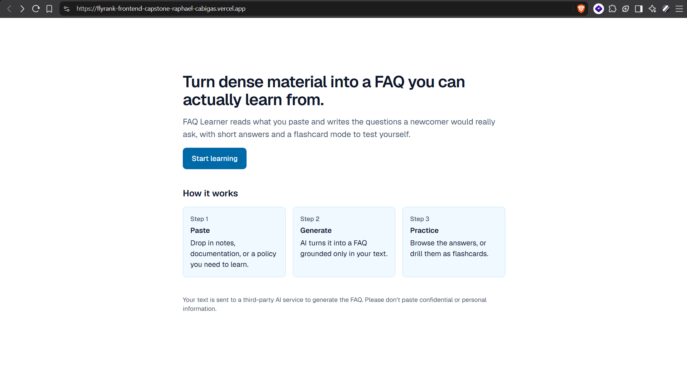
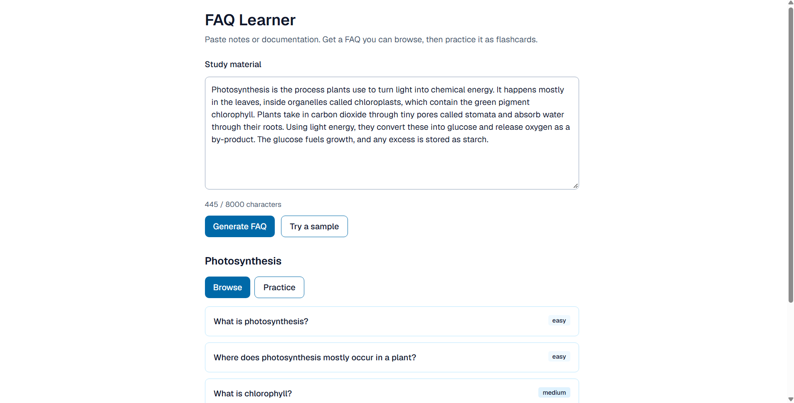
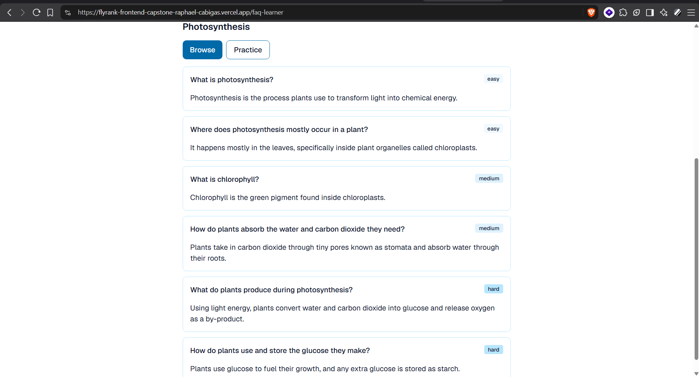
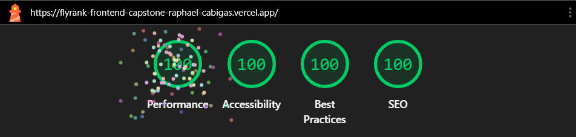
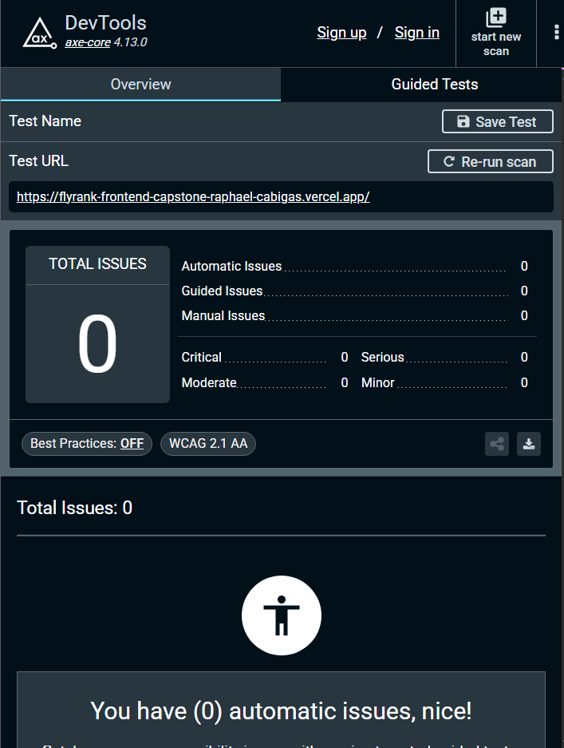

# FAQ Learner — FlyRank Frontend AI Capstone

FAQ Learner is an AI-powered web application that turns dense material into a FAQ you can actually learn from.

A user pastes notes, documentation, or a policy. FAQ Learner uses an AI-powered flow to write the questions a newcomer would really ask, with short answers grounded only in the pasted text. The user can then **Browse** the FAQ or **Practice** it as flashcards.

The project was built as the final capstone for the **FlyRank AI Engineering Frontend track**, with a focus on building a complete, accessible, resilient, and publicly deployed frontend application.

## Live Demo

**Production:** https://flyrank-frontend-capstone-raphael-cabigas.vercel.app

**Repository:** https://github.com/RaphaelCabigas/flyrank-frontend-capstone

The application is deployed on Vercel and connected to the GitHub repository. Every push builds a preview deployment, and the `main` branch deploys to production. Visit `/health` on any deployment to confirm it is running and fetching data correctly.

## Screenshots

### Homepage



### Paste Study Material and Generate



### Browse the Generated FAQ



### Lighthouse Quality Audit



| Category       |   Score |
| -------------- | ------: |
| Performance    | **100** |
| Accessibility  | **100** |
| Best Practices | **100** |
| SEO            | **100** |

### Accessibility Audit



The axe DevTools scan (axe-core 4.13.0, WCAG 2.1 AA) reported **0 issues**: zero automatic, guided, and manual issues, and zero critical, serious, moderate, and minor findings.

## What FAQ Learner Does

Dense notes and documentation are hard to learn from, and reading them is not the same as studying them. FAQ Learner turns that material into the questions a newcomer would ask, then lets you test yourself.

The application provides:

- A responsive homepage that explains the app
- A study-material box with a live character counter (up to 8,000 characters) and a "Try a sample" button
- An FAQ generator that writes questions and short answers grounded only in the pasted text
- Difficulty labels (`easy`, `medium`, `hard`) on each question
- A **Browse** mode for reading the FAQ
- A **Practice** mode for drilling the same content as flashcards
- A privacy notice that text is sent to a third-party AI service
- Loading, success, and error states
- Responsive layouts verified at 375px and 1280px
- Accessible, labeled form inputs with visible focus states
- A health-check route for verifying deployments

## Key Feature: AI FAQ Generation

The primary AI capability lives in the **FAQ Learner** page rather than a standalone chatbot.

A user pastes study material into the generator form and clicks **Generate FAQ**. The frontend sends the request to:

`POST /api/faqs`

The server-side route validates the input before sending it to the Google Gemini API (via the helper in `src/lib/gemini.js`). The generated FAQs are returned to the frontend and rendered in two views:

1. **Browse** — the questions and answers as a list, each tagged `easy`, `medium`, or `hard`
2. **Practice** — the same content as a flashcard deck for studying

Answers are grounded only in the text the user pasted, so the FAQ reflects their own material.

The API key stays on the server and is never exposed to the browser.

## Architecture Overview

FAQ Learner uses the **Next.js App Router** with JavaScript and Tailwind CSS.

```text
src/
├── app/
│   ├── api/
│   │   └── faqs/
│   │       └── route.js
│   ├── faq-learner/
│   │   └── page.jsx
│   ├── health/
│   │   └── page.jsx
│   ├── favicon.ico
│   ├── globals.css
│   ├── layout.jsx
│   └── page.jsx
├── components/
│   ├── FaqGenerator.jsx
│   ├── FaqList.jsx
│   └── FlashcardDeck.jsx
└── lib/
    ├── gemini.js
    ├── validateFields.js
    └── validateFields.test.js
public/
```

### Root Layout

`src/app/layout.jsx` provides the shared shell: global fonts via `next/font`, global CSS, metadata, and shared navigation.

### Design Tokens

`src/app/globals.css` is the only CSS file. It contains the Tailwind import and the `@theme` block that defines the **sky blue** palette through semantic tokens (`brand`, `brand-hover`, `brand-soft`, `surface`, `ink`, `muted`). Components use `bg-brand` instead of hardcoded colors.

### FAQ Learner Page

`src/app/faq-learner/page.jsx` is the main screen. It composes the generator, list, and flashcard components.

### Components

| Component           | Responsibility                                                                                             |
| ------------------- | ---------------------------------------------------------------------------------------------------------- |
| `FaqGenerator.jsx`  | Form for pasting study material, validating it, calling `/api/faqs`, and handling loading and error states |
| `FaqList.jsx`       | Renders the generated questions, answers, and difficulty tags (Browse)                                     |
| `FlashcardDeck.jsx` | Renders the generated FAQs as flashcards (Practice)                                                        |

### Library Helpers

| File                     | Responsibility                                                          |
| ------------------------ | ----------------------------------------------------------------------- |
| `gemini.js`              | Server-side helper that talks to the Google Gemini API                  |
| `validateFields.js`      | Standalone, exported validation function shared by the form and the API |
| `validateFields.test.js` | Tests for the validation logic                                          |

### Health Check

`src/app/health/page.jsx` is a server-rendered page that fetches data on the server and displays the result, so a deployment can be verified end to end.

### AI API Route

`src/app/api/faqs/route.js` runs on the server and:

1. Parses the incoming request
2. Validates the submitted fields with `validateFields`
3. Calls Gemini through `lib/gemini.js`
4. Returns the generated FAQs to the frontend
5. Returns a safe error response when anything fails

## Application Routes

| Route          | Purpose                                 |
| -------------- | --------------------------------------- |
| `/`            | Homepage                                |
| `/faq-learner` | FAQ generator, list, and flashcard deck |
| `/health`      | Deployment health-check page            |
| `/api/faqs`    | Server-side AI endpoint                 |

## Tech Stack

- **Next.js 16** (App Router)
- **React 19**
- **JavaScript (ES6+)**
- **Tailwind CSS 4**
- **ESLint**
- **Google Gemini API**
- **Vercel**
- **Git / GitHub**

## Environment Variables

Create a `.env.local` file in the project root (or copy `.env.example`) for local development.

| Variable         | Required | Purpose                                  |
| ---------------- | -------- | ---------------------------------------- |
| `GEMINI_API_KEY` | Yes      | Server-side Google Gemini authentication |

Example:

```env
GEMINI_API_KEY=your_gemini_api_key_here
```

**Never commit `.env` files or real API credentials.** The `.gitignore` excludes `.env*`, and `.env.example` documents the configuration without exposing secrets.

## Getting Started

### Prerequisites

- Node.js `>=20.9`
- npm `>=9.x`
- A Google Gemini API key

### Setup

```bash
# Clone the repo
git clone https://github.com/RaphaelCabigas/flyrank-frontend-capstone.git
cd flyrank-frontend-capstone

# Install dependencies
npm install

# Create your env file and add your key
cp .env.example .env.local

# Start the dev server (http://localhost:3000)
npm run dev

# Lint the project
npm run lint

# Build for production
npm run build

# Run the production build locally
npm run start
```

## Coding Conventions

- Components use `PascalCase`; functions and variables use `camelCase`; route folders use `kebab-case`.
- One component per file, matching the filename to the component name.
- Components are Server Components by default. `'use client'` is added only where interactivity is required and pushed as far down the tree as possible.
- Style with Tailwind utility classes only. No SCSS, CSS modules, or per-component stylesheets.
- Design tokens are defined once in `globals.css`; no hardcoded hex values in components.
- Mobile-first layouts, verified at 375px and 1280px with no horizontal scrolling.
- Validation logic lives in a standalone exported function in `src/lib`.
- Every input has a `<label>`; errors use `aria-invalid` and `aria-describedby`; toggle buttons set `aria-pressed`.
- Commit messages follow [Conventional Commits](https://www.conventionalcommits.org/) (e.g. `feat: add flashcard deck`).

See `CLAUDE.md` for the full set of conventions used when working with AI assistants.

## Accessibility

Accessibility was treated as part of the implementation:

- Semantic HTML and navigation landmarks
- Labeled inputs with accessible error messages (`aria-invalid`, `aria-describedby`)
- `aria-pressed` on interactive toggle buttons
- Visible keyboard focus states using `focus-visible:` utilities
- Responsive layouts with no horizontal scrolling

The production site was scanned with **axe DevTools** against WCAG 2.1 AA and reported **0 issues**, and Lighthouse scored **100** for Accessibility.

## Performance

The production site was audited with Lighthouse and scored **100** in Performance, Accessibility, Best Practices, and SEO (see the Screenshots section).

## Production Hygiene & Resilience

Study material is trimmed and checked by the shared `validateFields` function, and the UI shows a live counter against the 8,000-character limit. Because the same function is used by the API route, protection does not rely only on the UI.

The application handles:

- Invalid or incomplete input
- Invalid request bodies
- AI service failures

Users get a safe, readable error message when the AI service cannot complete a request.

## Technical Decisions

### Server-side AI integration

The Gemini request is made from a Next.js route handler through a dedicated `lib/gemini.js` helper instead of from the browser. This keeps the API key out of client-side JavaScript and keeps AI logic in one place.

### Shared, testable validation

Validation lives in `lib/validateFields.js` as a standalone exported function rather than a closure inside a component. That makes it reusable on the client and server, and easy to unit test.

### Server Components by default

Pages render on the server and only the interactive pieces (the generator form and flashcards) are Client Components, which keeps the JavaScript sent to the browser small.

### Tailwind-only styling with semantic tokens

All styling uses Tailwind utilities with brand tokens defined once in `globals.css`, so the palette stays consistent and a theme change is a one-file edit.

### One dataset, two study modes

The same generated FAQs power both the list and the flashcard deck, so users can read first and then test themselves without re-generating.

### Keep the scope focused

FAQ Learner is intentionally scoped as a capstone. The goal was a complete frontend workflow with meaningful AI integration, not authentication, databases, or other infrastructure the core experience doesn't need.

## Deployment

FAQ Learner is deployed on **Vercel** and connected to the GitHub repository.

- Every push builds a preview deployment.
- The `main` branch deploys to production.
- `npm run lint` and `npm run build` pass before each release.
- `/health` verifies that a deployment is running and fetching data.

Environment variables are configured in the Vercel project settings, so no credentials live in the repository.

## Known Limitations

- No user authentication
- No persistent database; generated FAQs are not saved between sessions
- AI-generated content is informational and may contain mistakes
- Pasted text is sent to a third-party AI service, so confidential or personal information should not be used
- The generator depends on the availability of the external AI service

These are deliberate scope decisions for the capstone.

## Future Improvements

- Save decks and track study progress
- Shuffle and "mark as known" modes for flashcards
- Export FAQs or flashcards
- User accounts
- Expanded automated and end-to-end tests
- Further performance optimization as the app grows

## How AI Tools Were Used

AI tools were used as **development assistants**, not as a replacement for testing or engineering judgment. They helped with exploring approaches, generating and refining components, debugging JSX and Tailwind issues, reviewing accessibility, improving validation and error handling, and structuring documentation.

A `CLAUDE.md` file in the repository documents the project conventions given to AI assistants. Generated code was reviewed, adapted to the project, linted, built, and verified on the deployed preview.

For the product feature itself, Google Gemini is the external AI service used by the application.

## Capstone Reflection

FAQ Learner evolved from an initial Next.js scaffold into a publicly deployed AI-powered study app.

The final implementation focuses on a complete user journey: pasting study material, validating the input, generating a grounded FAQ through a server-side AI route, then browsing it or practicing it as flashcards, and handling failures gracefully, all delivered through a production deployment.

The project provided practical experience with the Next.js App Router, Server and Client Components, Tailwind design tokens, accessibility, server-side AI integration, environment management, and Git-based deployment on Vercel.

---

**Built by Raphael Cabigas as part of the FlyRank Frontend AI Engineering Internship — July 2026.**

Licensed under the [MIT License](LICENSE).
